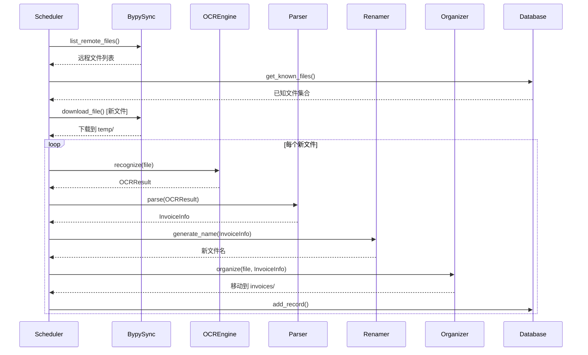

# ARCH.md - 系统架构设计

## 1. 系统架构图

```
┌─────────────────────────────────────────────────────────────────────────────┐
│                          出差发票自动整理系统                                │
└─────────────────────────────────────────────────────────────────────────────┘

    ┌──────────────┐                       ┌──────────────┐
    │  邮箱云端    │                       │  百度网盘云端 │
    │  (IMAP)      │                       │  (bypy)      │
    └──────┬───────┘                       └──────┬───────┘
           │                                      │
           ▼                                      ▼
    ┌──────────────┐                     ┌──────────────┐
    │ email_sync   │                     │ bypy_sync    │
    │ 模块(默认)    │                     │ 模块(可选)    │
    └──────┬───────┘                     └──────┬───────┘
           │                                      │
           └──────────────┬───────────────────────┘
                          ▼
                 ┌──────────────┐
                 │  temp/       │
                 │  临时目录     │
                 └──────┬───────┘
                        ▼
                 ┌──────────────┐
                 │  ocr_engine  │
                 │  PaddleOCR   │
                 └──────┬───────┘
                        │
                        ▼
┌──────────────┐     ┌──────────────┐     ┌──────────────┐ ┌──────────────┐
│  invoices/   │ ◀─  │  organizer   │ ◀─  │   parser     │ │              │
│  本地整理目录 │     │   文件组织    │     │   信息解析    │ │   renamer    │
└──────────────┘     └──────────────┘     └──────────────┘ │   重命名      │
                                                   ▲        └──────────────┘
                                                   │
┌──────────────┐     ┌──────────────┐            │
│ records.db   │ ◀─ │  scheduler   │ ────────────┘
│ SQLite记录   │     │  定时调度    │
└──────────────┘     └──────────────┘
```

## 2. 模块设计

### 2.1 email_sync.py - 邮箱同步模块 (默认)

**职责**：使用 IMAP 协议从邮箱下载发票附件

**接口定义**：
```python
class EmailSyncManager:
    """邮箱同步管理器（基于 IMAP）"""

    def connect(self) -> bool:
        """连接 IMAP 服务器"""

    def list_emails(self, since_date: datetime, limit: int) -> List[EmailMeta]:
        """列出邮件"""

    def sync_new_files(self, known_files: Set[str]) -> List[str]:
        """
        同步新增邮件附件

        Args:
            known_files: 已知邮件 UID 集合

        Returns:
            List[str]: 新下载的本地文件路径列表
        """
```

**数据结构**：
```python
@dataclass
class EmailMeta:
    uid: str                    # IMAP UID (唯一标识)
    subject: str
    sender: str
    sender_name: str
    date: datetime
    has_attachment: bool
    message_id: str

@dataclass
class AttachmentMeta:
    filename: str
    content_type: str
    size: int
```

**过滤规则**：
- **发件人域名**: @ctrip.com, @ceair.com, @marriott.com, @didiglobal.com 等
- **主题关键词**: 行程单、订单、发票、预订、差旅
- **附件类型**: .pdf, .jpg, .png, .bmp

### 2.1b bypy_sync.py - 百度网盘同步模块 (可选)

**职责**：封装 bypy 操作，负责远程文件列表获取和文件下载

**接口定义**：
```python
class BypySyncManager:
    """百度网盘同步管理器（基于 bypy）"""

    def list_remote_files(self, remote_dir: str = "invoices") -> List[FileMeta]:
        """
        获取远程文件列表

        Returns:
            List[FileMeta]: 文件元数据列表
                - path: 远程路径
                - size: 文件大小
                - mtime: 修改时间
        """

    def download_file(self, remote_path: str, local_path: str) -> bool:
        """
        下载单个文件

        Args:
            remote_path: 远程文件路径（相对于 /apps/bypy/）
            local_path: 本地保存路径

        Returns:
            bool: 下载是否成功
        """

    def sync_new_files(self, known_files: Set[str]) -> List[str]:
        """
        同步新增文件

        Args:
            known_files: 已知文件集合（从数据库读取）

        Returns:
            List[str]: 新下载的本地文件路径列表
        """
```

**数据结构**：
```python
@dataclass
class FileMeta:
    path: str           # 文件路径
    size: int           # 字节
    mtime: int          # Unix 时间戳
    md5: Optional[str]  # MD5（可选）
```

### 2.2 ocr_engine.py - OCR 引擎模块

**职责**：封装 PaddleOCR，执行图片/PDF的文本识别

**接口定义**：
```python
class OCREngine:
    """OCR 引擎（基于 PaddleOCR）"""

    def recognize(self, file_path: str) -> OCRResult:
        """
        识别文件中的文字

        Args:
            file_path: 文件路径（支持 pdf, jpg, png）

        Returns:
            OCRResult:
                - text: 完整文本
                - lines: 按行分割的文本列表
                - confidence: 平均置信度
        """

    def recognize_pdf(self, pdf_path: str) -> OCRResult:
        """
        识别 PDF 文件（多页合并）

        Args:
            pdf_path: PDF 文件路径

        Returns:
            OCRResult: 识别结果
        """
```

**数据结构**：
```python
@dataclass
class OCRResult:
    text: str                    # 完整文本
    lines: List[str]             # 按行分割
    confidence: float            # 置信度 0-1
    raw_data: Optional[dict]     # 原始返回数据
```

### 2.3 parser.py - 发票信息解析模块

**职责**：从 OCR 文本中提取发票结构化信息

**接口定义**：
```python
class InvoiceParser:
    """发票信息解析器"""

    def __init__(self, rules_path: str = "config/parsers.yaml"):
        """加载解析规则"""

    def parse(self, ocr_result: OCRResult) -> InvoiceInfo:
        """
        解析发票信息

        Args:
            ocr_result: OCR 识别结果

        Returns:
            InvoiceInfo: 结构化发票信息
        """

    def detect_type(self, ocr_result: OCRResult) -> InvoiceType:
        """
        检测发票类型

        Returns:
            InvoiceType: 枚举值（机票、火车、住宿、餐饮、其他）
        """
```

**数据结构**：
```python
@dataclass
class InvoiceInfo:
    # 基础信息
    type: InvoiceType              # 发票类型
    date: date                     # 开票日期
    amount: Decimal                # 金额

    # 出差信息
    traveler: str                  # 出差人

    # 交通类专属
    origin: Optional[str] = None   # 出发地
    destination: Optional[str] = None  # 目的地
    transport_mode: Optional[str] = None  # 交通方式

    # 住宿类专属
    city: Optional[str] = None     # 城市
    hotel_name: Optional[str] = None  # 酒店名称
    stay_days: Optional[int] = None  # 入住天数

    # 其他
    raw_name: Optional[str] = None  # 原始文件名
    confidence: float = 0.0        # 解析置信度

class InvoiceType(Enum):
    AIRPLANE = "机票"
    TRAIN = "火车"
    TAXI = "打车"
    HOTEL = "住宿"
    DINING = "餐饮"
    CAR_RENTAL = "租车"
    OTHER = "其他"
```

**解析规则配置（parsers.yaml）**：
```yaml
# 发票类型检测规则
type_detection:
  airplane:
    keywords: ["航空运输", "客票行程单", "航班", "CA", "MU", "CZ"]
    priority: 10
  train:
    keywords: ["中国铁路", "车次", "座位", "站", "￥"]
    priority: 9
  taxi:
    keywords: ["出租车", "网约车", "滴滴", "里程", "里程费"]
    priority: 8
  hotel:
    keywords: ["住宿费", "酒店", "宾馆", "民宿", "房费"]
    priority: 7

# 字段提取规则（正则表达式）
field_extraction:
  date:
    - pattern: '(\d{4})[-/年](\d{1,2})[-/月](\d{1,2})'
      format: "{1}-{2:0>2}-{3:0>2}"
  amount:
    - pattern: '￥(\d+\.\d{2})'
    - pattern: '¥(\d+\.\d{2})'
  airplane_route:
    - pattern: '(\w+)\s*→\s*(\w+)'
  train_route:
    - pattern: '(\w+)站.*(\w+)站'
```

### 2.4 renamer.py - 文件重命名模块

**职责**：根据发票信息生成规范的文件名

**接口定义**：
```python
class InvoiceRenamer:
    """发票文件重命名器"""

    def generate_name(self, info: InvoiceInfo) -> str:
        """
        生成规范文件名

        Args:
            info: 发票信息

        Returns:
            str: 规范文件名（不含扩展名）
        """

    def make_unique(self, base_name: str, ext: str, output_dir: str) -> str:
        """
        确保文件名唯一（处理冲突）

        Returns:
            str: 唯一的完整文件名
        """
```

**命名规则**（按发票类型）：
```python
def generate_name(self, info: InvoiceInfo) -> str:
    """命名规则映射"""
    date_str = info.date.strftime("%Y-%m-%d")
    amount_str = f"{info.amount:.2f}"

    rules = {
        InvoiceType.AIRPLANE: f"{date_str}_机票_{info.origin}_{info.destination}_{amount_str}_{info.traveler}",
        InvoiceType.TRAIN: f"{date_str}_火车_{info.origin}_{info.destination}_{amount_str}_{info.traveler}",
        InvoiceType.TAXI: f"{date_str}_打车_{info.origin}_{info.destination}_{amount_str}_{info.traveler}",
        InvoiceType.HOTEL: f"{date_str}_住宿_{info.city}_{info.hotel_name}_{amount_str}_{info.traveler}",
        InvoiceType.DINING: f"{date_str}_餐饮_{info.city}_{amount_str}_{info.traveler}",
        InvoiceType.CAR_RENTAL: f"{date_str}_租车_{info.city}_{info.stay_days}天_{amount_str}_{info.traveler}",
        InvoiceType.OTHER: f"{date_str}_其他_{info.type.value}_{amount_str}_{info.traveler}",
    }

    return rules.get(info.type, rules[InvoiceType.OTHER])
```

### 2.5 organizer.py - 文件组织模块

**职责**：将文件移动/复制到分类目录

**接口定义**：
```python
class InvoiceOrganizer:
    """发票文件组织器"""

    def get_target_path(self, info: InvoiceInfo) -> Path:
        """
        计算目标路径

        Returns:
            Path: 目标完整路径，如：invoices/2025/02/交通/xxx.pdf
        """

    def organize(self, src_path: str, info: InvoiceInfo, dry_run: bool = False) -> str:
        """
        整理文件到目标目录

        Args:
            src_path: 源文件路径
            info: 发票信息
            dry_run: 模拟运行

        Returns:
            str: 目标文件路径
        """
```

**目录结构计算**：
```python
def get_target_path(self, info: InvoiceInfo) -> Path:
    """计算目标路径"""
    # 基础目录：invoices/{年}/{月}/
    year_month = info.date.strftime("%Y/%m")

    # 类型分类
    type_dir = {
        InvoiceType.AIRPLANE: "交通",
        InvoiceType.TRAIN: "交通",
        InvoiceType.TAXI: "交通",
        InvoiceType.HOTEL: "住宿",
        InvoiceType.DINING: "餐饮",
        InvoiceType.CAR_RENTAL: "其他",
        InvoiceType.OTHER: "其他",
    }[info.type]

    return Path(f"invoices/{year_month}/{type_dir}")
```

### 2.6 scheduler.py - 定时调度模块

**职责**：定时执行扫描、处理任务

**接口定义**：
```python
class TaskScheduler:
    """任务调度器"""

    def __init__(self, config_path: str = "config/config.yaml"):
        """加载配置"""

    def run_once(self) -> TaskResult:
        """
        执行一次完整任务流程

        Returns:
            TaskResult: 任务执行结果统计
        """

    def start_daily(self, hour: int = 2, minute: int = 0):
        """
        启动每日定时任务

        Args:
            hour: 执行小时（默认凌晨2点）
            minute: 执行分钟
        """
```

**任务流程**：
```python
def run_once(self) -> TaskResult:
    """完整任务流程"""
    result = TaskResult()

    # 1. 从数据库读取已处理文件
    known_files = self.db.get_known_files()

    # 2. bypy 同步新文件
    new_files = self.bypy_sync.sync_new_files(known_files)

    # 3. 处理每个新文件
    for file_path in new_files:
        try:
            # OCR 识别
            ocr_result = self.ocr.recognize(file_path)

            # 解析发票信息
            info = self.parser.parse(ocr_result)

            # 生成新文件名
            new_name = self.renamer.generate_name(info)
            new_name = self.renamer.make_unique(new_name, ext, output_dir)

            # 移动到目标目录
            target = self.organizer.organize(file_path, info)

            # 记录到数据库
            self.db.add_record(file_path, info)

            result.success += 1
        except Exception as e:
            logger.error(f"处理失败: {file_path}, {e}")
            result.failed += 1

    return result
```

**数据结构**：
```python
@dataclass
class TaskResult:
    total: int = 0          # 总文件数
    success: int = 0        # 成功处理
    failed: int = 0         # 处理失败
    skipped: int = 0        # 跳过（已存在）
    start_time: datetime = None
    end_time: datetime = None
```

### 2.7 records.db - SQLite 数据库

**职责**：记录已处理的文件，避免重复处理

**表结构**：
```sql
-- 处理记录表
CREATE TABLE IF NOT EXISTS processed_files (
    id INTEGER PRIMARY KEY AUTOINCREMENT,
    remote_path TEXT NOT NULL UNIQUE,      -- 远程路径
    local_path TEXT,                       -- 原本地路径（临时）
    final_path TEXT,                       -- 最终路径
    file_hash TEXT,                        -- 文件哈希（可选）
    processed_at TIMESTAMP DEFAULT CURRENT_TIMESTAMP,
    invoice_type TEXT,
    invoice_date DATE,
    amount DECIMAL(10,2),
    traveler TEXT,
    status TEXT DEFAULT 'success'          -- success, failed
);

-- 索引
CREATE INDEX idx_remote_path ON processed_files(remote_path);
CREATE INDEX idx_processed_at ON processed_files(processed_at);
```

**接口定义**：
```python
class RecordDatabase:
    """处理记录数据库"""

    def is_processed(self, remote_path: str) -> bool:
        """检查文件是否已处理"""

    def add_record(self, remote_path: str, info: InvoiceInfo, final_path: str):
        """添加处理记录"""

    def get_known_files(self) -> Set[str]:
        """获取所有已处理的远程文件路径"""
```

## 3. 数据流



## 4. 依赖关系

```
┌──────────────┐
│  scheduler   │ ──▶ 调度所有模块
└──────────────┘
       │
       ├──▶ bypy_sync ──▶ bypy (外部包)
       ├──▶ ocr_engine ──▶ PaddleOCR (外部包)
       ├──▶ parser ──▶ parsers.yaml
       ├──▶ renamer
       ├──▶ organizer
       └─── database ──▶ SQLite
```

## 5. 外部依赖

| 依赖 | 版本 | 用途 |
|-----|------|------|
| bypy | latest | 百度网盘同步 |
| paddleocr | latest | OCR 识别 |
| paddlepaddle | latest | PaddleOCR 后端 |
| PyYAML | latest | 配置文件解析 |
| apscheduler | latest | 定时任务 |
| loguru | latest | 日志记录 |

---

**创建时间**: 2025-02-22
**状态**: DRAFT
